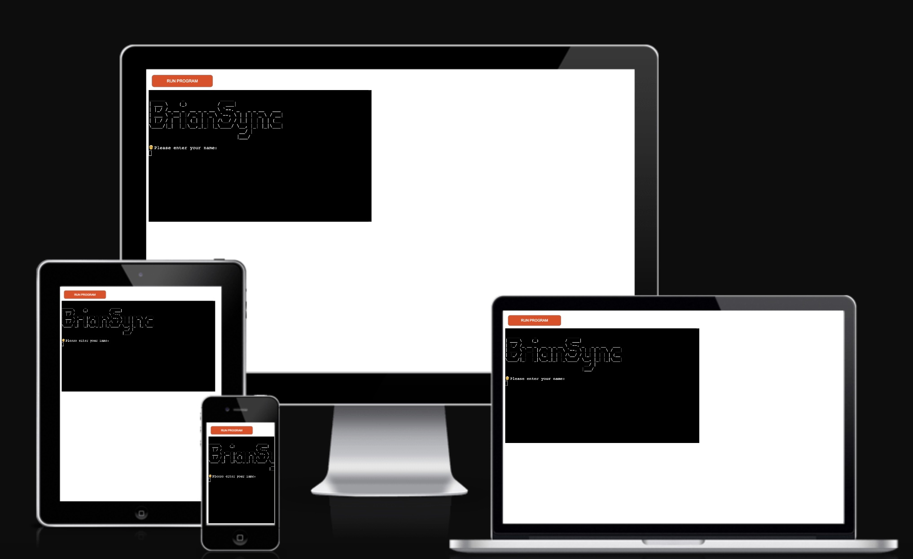
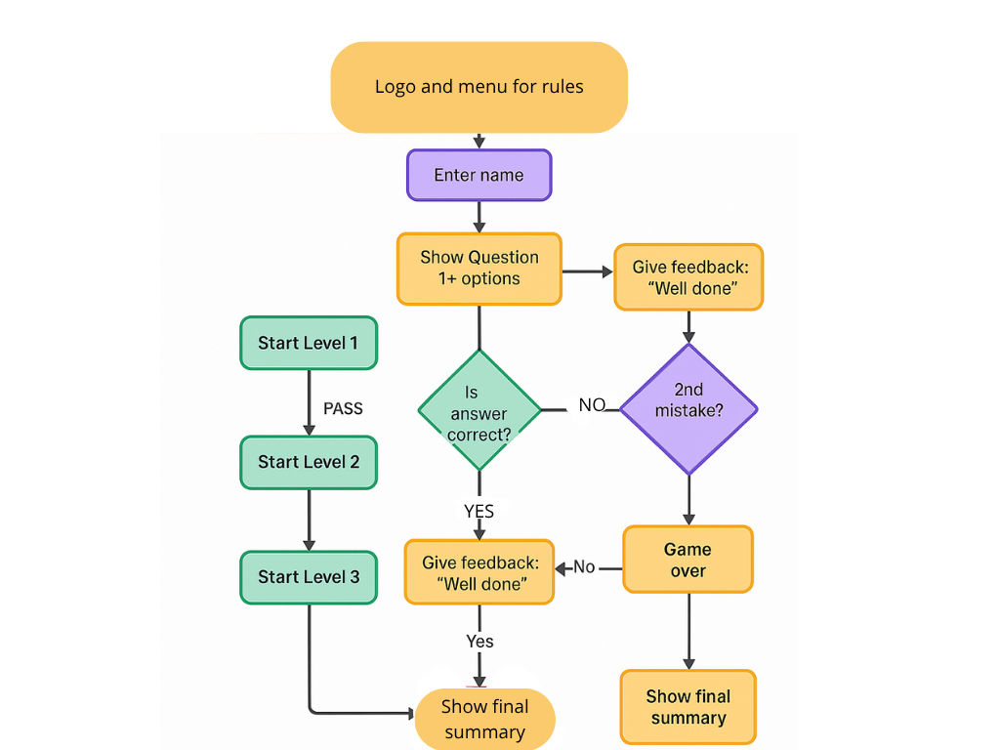
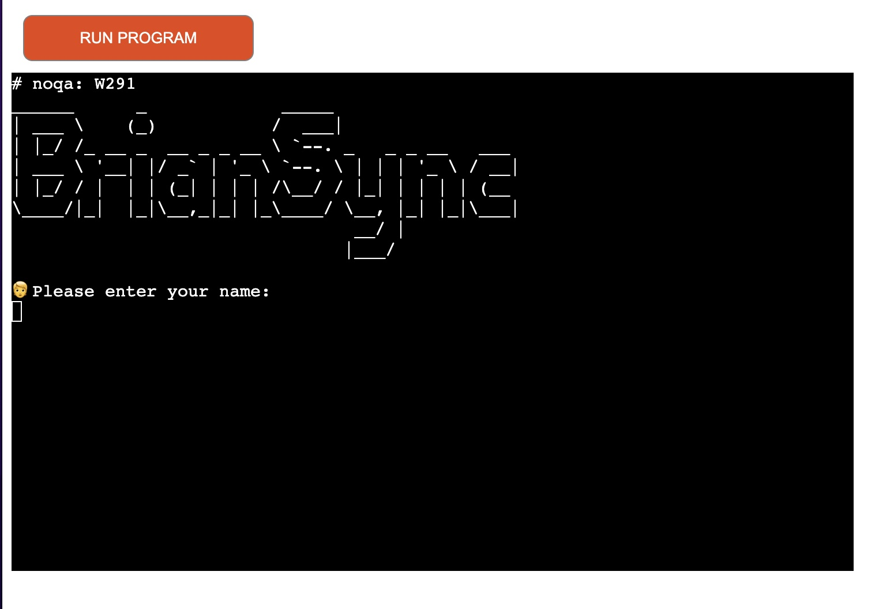
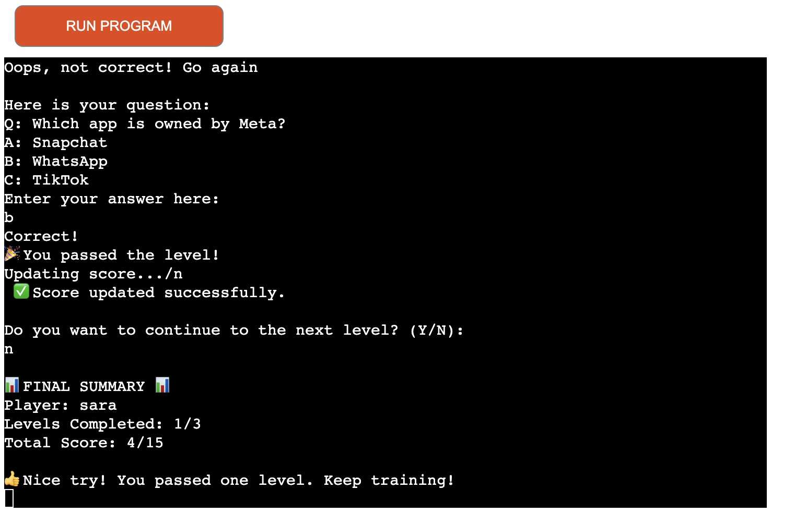
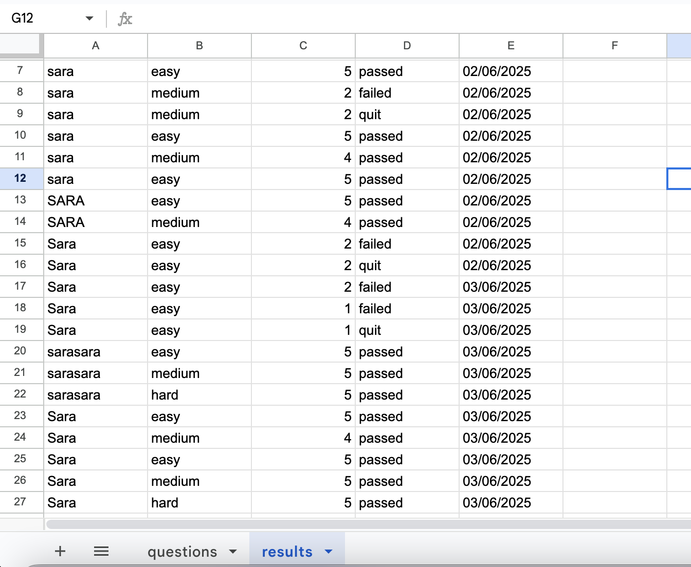

# BRIANSYNC 

A terminal-based multiple-choice quiz game connected to Google Sheets for score tracking and progression logging.

The deployed project live link is [HERE](https://brainsync-0f71c4bb1b9c.herokuapp.com/)

## 📌 Contents

- [Introduction](#introduction)  
- [Project Goals](#project-goals)  
- [User Goals](#user-goals)  
- [Site Owner Goals](#site-owner-goals)  
- [Pre-Development Planning](#pre-development-planning)  
- [Development](#development)  
- [Features](#features)  
- [Game Flow](#game-flow)  
- [Google Sheets Integration](#google-sheets-integration)  
- [Technologies Used](#technologies-used)   
- [Testing](#testing)  
- [Validation](#validation)  
- [Deployment](#deployment)  
- [Bugs](#bugs)  
- [Credits](#credits)  

---

## 🧠 Introduction

**BrainSync** is a fun and engaging quiz program designed to challenge users across 3 levels of difficulty: Easy, Medium, and Hard. It uses a Google Sheet to retrieve and store questions and user scores. The game is designed to run in a terminal environment and provides instant feedback, score tracking, and end-of-game summaries.

---

## 🎯 Project Goals

- Provide a simple but engaging educational quiz game.
- Introduce users to progressively challenging content.
- Encourage learning through fun and competition.
- Log all user performance data for future insights.

---

## 🙋‍♂️ User Goals

- Understand the game rules clearly.
- Play through multiple quiz levels with increasing difficulty.
- Get instant feedback on answers.
- Receive a final performance summary.
- Ensure progress is saved securely.

---
## 💼 Site Owner Goals

- Present an interactive educational tool.
- Collect user performance data via Google Sheets.
- Provide an intuitive, bug-free experience.
- Keep the code modular and scalable for future improvements.

---
## 📝 Pre-Development Planning

- Brainstormed quiz mechanics and win/loss conditions.
Wireframes 
- Created question templates for Google Sheets.
- Planned function responsibilities (e.g., user input, score tracking, game flow).
- Outlined a clear UI in terminal format with visual ASCII art and emojis for feedback.

---
## 💻 Development

- Used Python and `gspread` to connect with Google Sheets.
- Structured code for clear function segregation.
- Added terminal UI elements: title screen, menu, rules, and real-time prompts.
- Enabled score persistence using Google Sheets append functionality.

---
## ✨ Features

### 🧾 Terminal UI with ASCII Art  
Displays a welcoming title screen and clear visual feedback.

### 📜 Game Rules Display  
Accessible from the main menu at any time.

### 🔁 Three-Level Structure  
Players must answer 5 questions per level and need at least 4 correct answers to advance.

### ❌ Mistake Limiter  
Users are allowed only 1 mistake per level; 2 mistakes ends the game.

### ✅ Real-time Feedback  
Immediate response after each answer—correct or incorrect.

### 📊 Final Summary  
Reports the number of levels passed and the total score.

---
## 🎮 Game Flow

1. Welcome screen and player name input.
2. Main menu with options to:
   - Start Quiz
   - View Rules
   - Exit
3. Each level contains:
   - 5 multiple-choice questions
   - Feedback after each question
   - Score tracking
4. At the end of each level:
   - Option to continue or quit
   - Score saved to Google Sheets

---
## 🗂️ Google Sheets Integration

BrainSync uses two worksheets:

- **`questions`**: Stores all multiple-choice questions with options and correct answers.
 
- **`results`**: Logs user scores including:
  - Username
  - Level played
  - Score
  - Status (passed/failed/quit)
  - Date of play
 
 
 ---

 ## 🛠️ Technologies Used

- Python 3
- Google Sheets API
- GitHub
- CodeAnywhere
- Heroku
- Python Library´s

---
## Testing

The portal has undergone extensive testing, and the results are available for review
[here - TESTING](https://github.com/Saretta1194/BrainSync/blob/main/TESTING.md)

### Validator

- CI Python Linter
  - No errors were returned when passing the final version through the Python Linter with the code # noqa: W291  [CI Python Linter](https://pep8ci.herokuapp.com)

 
 - Without this code the Python Linter returned error W291 inside the ASCII Logo 
  

  
## Deployment
- The deployment was done through heroku. following the steps below:
  - Preparing for deployment:
      - Add a new line character ("\n") at the end of each input request.
      - Create a list of dependancies to go into the requirements.txt file by typing "pip3 freeze > requirements.txt" into the terminal.
  - Deployment:
      - Log into Heroku and in the dashboard, press the "Create new app" button.
      - Click on the "Settings" tab, scroll down to the "Reveal Config Vars" button and click on it to create config vars.
      - Add the first config vars. The key is "CREDS" and value is the contents of the creds.json file.
      - Add the second config vars. The key is "PORT" and value is "8000".
      - Click on the "Add buildpack" button on the same page and add the buildpacks "python" and "node.js" in this order.
      - Click on the "Deploy" tab.
      - Choose the "GitHub" deployment method and then connect to GitHub.
      - Scroll down to the "Manual deploys" section, select the "main" branch to deploy from and then press the "Deploy branch" button to deploy the project.

## Bugs
I encountered a bug where the Python Linter flagged a W291 error caused by trailing whitespace in the ASCII logo section of the code. Since the spacing was intentional to preserve the visual formatting of the logo, this warning was not relevant to the functionality of the program. To resolve the issue, I used the # noqa: W291 comment to suppress the linter warning on those specific lines.

## Credits
## 🙌 Credits

- The base structure of the project was built using the official **Code Institute template**, which provided a solid starting point for development.
- I referred to articles and tutorials on [Real Python](https://realpython.com/) for best practices and Python logic structuring.
- Thanks to the **Slack community** for support and feedback during the development process.
- Special thanks to my **mentor**, who consistently guided me in the right direction, especially regarding project structure, validation, and clarity.
- YouTube resources were also helpful in shaping specific functions — particularly this tutorial on quiz logic and scoring:  
  [Quiz game in Python](https://www.youtube.com/watch?v=xCREVkSVZ-c)
- Google Sheets functionality was implemented using the `gspread` and `google-auth` libraries.
- General Python tips and formatting references came from:
  - [FreeCodeCamp – Python for Beginners](https://www.freecodecamp.org/)
  - [W3Schools – Python Formatting](https://www.w3schools.com/python/)
